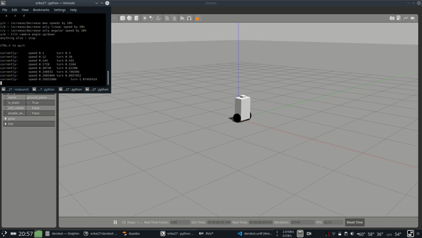

# sbrobot
Gazebo simulation of simple self balancing robot

Made with cascaded PID. PID for wheel speed control, PID for balancing about set point, PID for controlling set point to maintain constant velocity.
 

